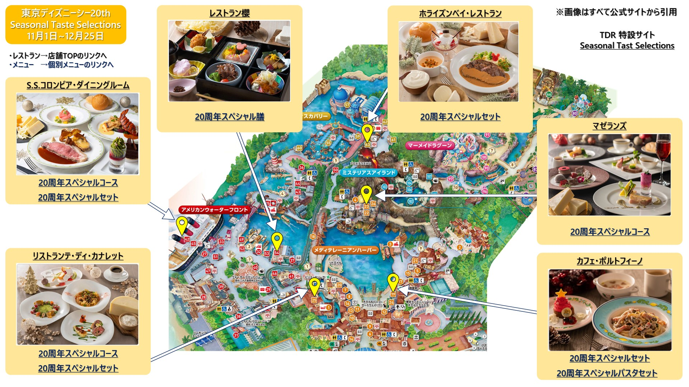

先日、シーズナルテイストセレクションズの2期目のテーマとメニューが発表されたので
実施店舗とメニューをまとめてみました。

## 11月からのテーマ

11月1日から12月25日までの期間は`チーズ`を主テーマとのこと。
対象店舗にて食事をお楽しみ頂けるとのことです。たのしみだ!

## メニューマップ
ということで自分のメモ用にメニューマップを作成してみました。

詳細情報は公式ページにて確認していただくことをお勧めしています。

シーズナルテイストセレクションズの公式のリンク
→[こちら](https://www.tokyodisneyresort.jp/treasure/seasonaltasteselections/)

また下記でダウンロードできるPDFではレストラン名・メニュー名をクリックしたりすることでTDR公式サイトまで飛べます。

## PDF版

自分用なので参考程度に使っていただければなと思っていますが誤記とかあればぜひご指摘ください!

[PDFダウンロードリンク](./SeasonalTasteSelections_20211001_r5.pdf)

